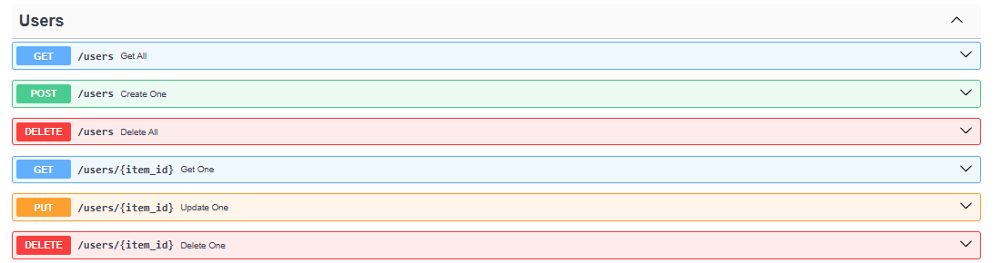
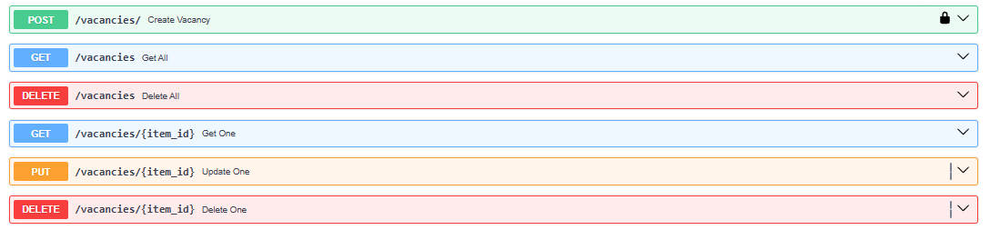
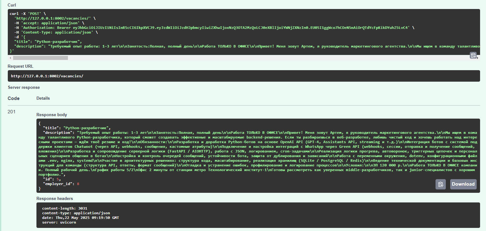
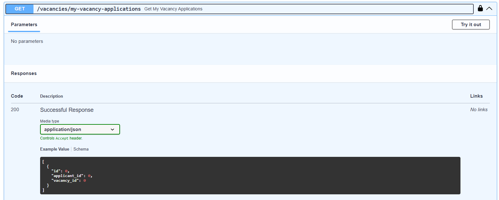
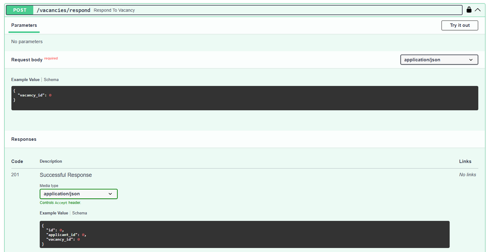
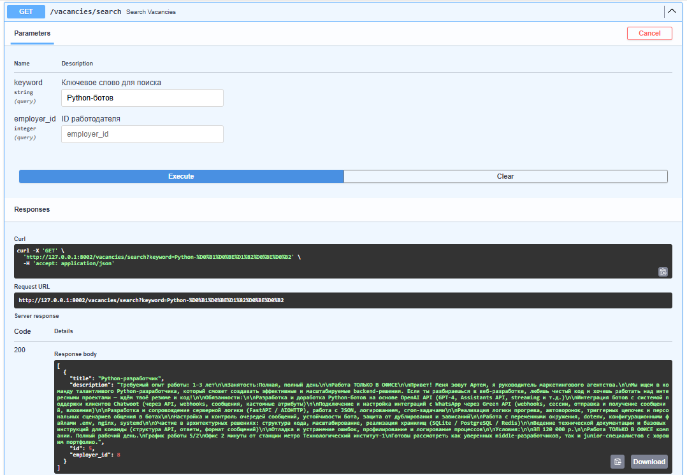
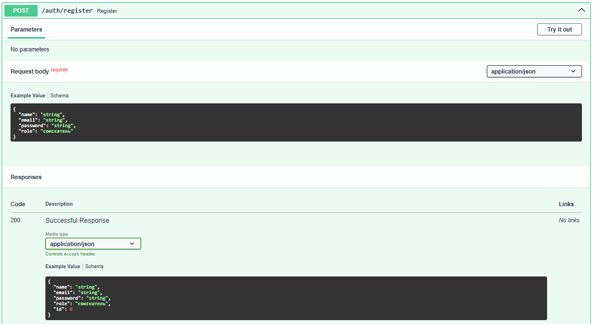
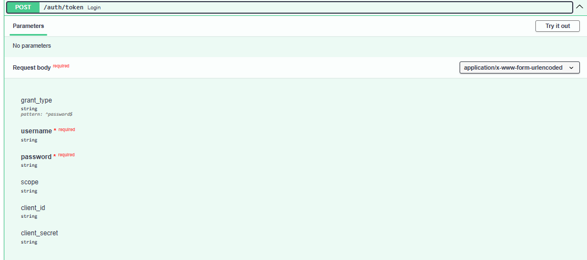
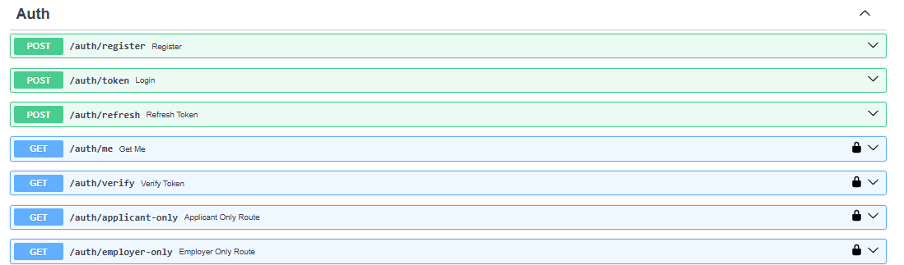

# Проект по поиску работы для джунов

## Запускаем в Docker

```bash
docker-compose up --build
```

## Эндпоинты

- Есть CRUD API пользователей и вакансий для взаимодействия с ними во время разработки




- Создание вакансии доступный только авторизованным работадателям



- Просмотр всех откликов на ваканасии авторизованного работадателя



- Отклик на вакансию доступный только авторизованным соискателям



- Поиск вакансии по ключевой фразе или работадателю



- Регистрация пользователя (роли: соискатель, работадатель)



- Авторизация пользователя (выдача JWT access и refresh токенов)



- Еще есть:
  - /me (показывающий текущего пользователя)
  - /verify (проверяющий access токен)
  - /applicant-only (проверяющий роль соискателя)
  - /employer-only (проверяющий роль работадателя)
  


Для доступа к API (после запуска в Docker): http://127.0.0.1:8002/docs

## Инструменты

- Для CRUD используется: https://fastapi-crudrouter.awtkns.com/
- Для работы с ролями (авторизация, регистрация) будет юзаться: OAuth2
