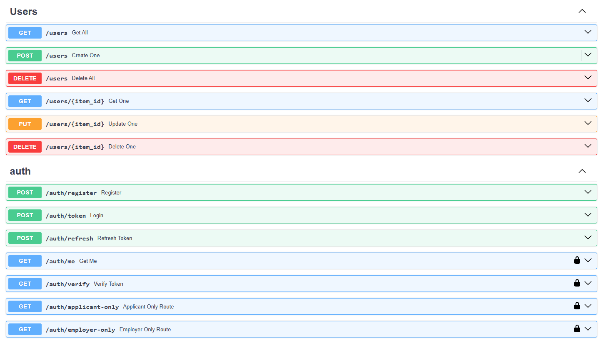

# Проект по поиску работы для джунов

## Запускаем в Docker

```bash
docker-compose up --build
```

Вот так выглядит


Для доступа к API: http://127.0.0.1:8002/docs

## Инструменты

- Для CRUD используется: https://fastapi-crudrouter.awtkns.com/
- Для работы с ролями (авторизация, регистрация) будет юзаться: OAuth2
